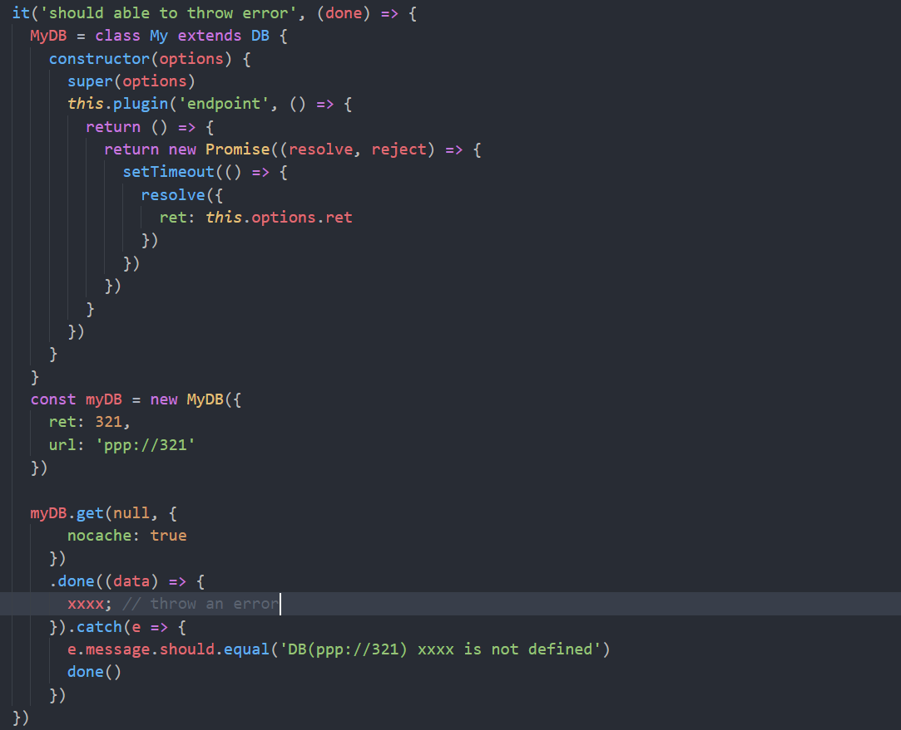
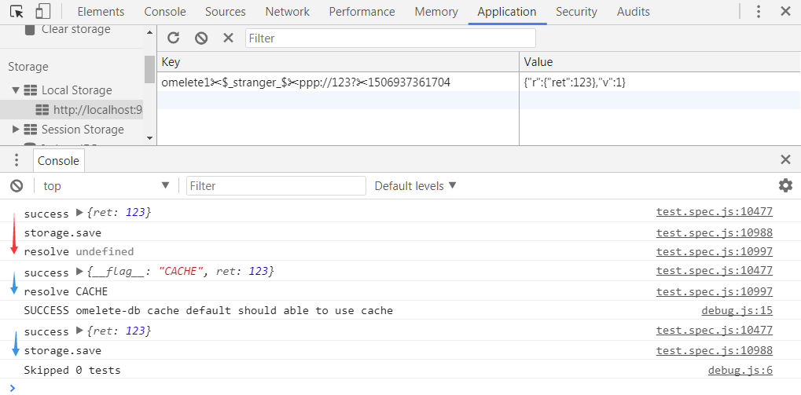

#omelete-db

### 下载开发库
npm install --save-dev karma
npm install --save-dev webpack
npm install --save-dev mocha

### 先做测试用例
1.编写 karma.conf.js
查 karma文档  https://karma-runner.github.io/1.0/config/configuration-file.html
使用 karma init 配置初始文件
> 1. **files:  添加外部 files**
> 需要引入的如 jQuery (未添加)
>   
> 2. **browsers:  ['Chrome', 'PhantomJS'] **
> 需要安装 `karma-chrome-launcher`, `karma-phantomjs-launcher`
> 
> 3. **reporters: ['mocha', 'should;'']**
> 为使karma日志输出保持mocha原来的风格 使用 `karma-mocha-reporter`
> 为使用 should.js 断言 安装 `should`, `karma-should`
> 
> 4. **preprocessors: { 'test/*spec.js': ['webpack'] } **
> 使用 webpack  使用 `karma-webpack`  需要提前安装 `babel-core`
> 5. **webpack:** 配置 测试webpack，
> 设置 rules 使用 es6 语法 ：
> ```javascript
	{
        test: /\.js$/,
        exclude: /(node_modules|bower_components)/,
        use: [
          {
            loader: 'babel-loader',
            options: {
              presets: ['es2015']
            }
          }
        ]
      }
> ```
> babel 6默认情况下并没有转换ES6代码的功能，需要安装相应的转换器插件 `babel-preset-es2015`

然后在spec.js编写使用should断言的es6代码，测试 karma start 运行是否正常
> 附上各个文档地址
> karma configuration file: https://karma-runner.github.io/1.0/config/configuration-file.html
> should.js https://shouldjs.github.io/
> mocha https://mochajs.org/
> karma-should https://github.com/ruimarinho/karma-should
> babel-preset-env https://github.com/babel/babel-preset-env

2.分析需求，并把最基础的测试用例写出来
> 需求： https://github.com/kangschampagne/homework3

> 1. 后台返回数据结构为
> ```javascript
> {
>   retcode: Number, // 可以是0(正确)，1(登陆台丢失)等等
>   msg: String, // 错误时候返回的信息
>   res: any // 附带的结果
> }
> ```
>  `解决`：使用 大搜车的 easy-mock 进行 api 返回
>  BaseURL: https://www.easy-mock.com/mock/59c74abbe0dc663341b6ef18/omelete-db
> 
> 2. 每一种请求都可以通过 localStorage 做缓存
> 缓存策略: 
>> // 0. 默认，情况下，如果没缓存，成功请求回调一次，如果有请求成功缓存应当回调两次，这样可以保证页面快速渲染，而不需要等数据返回
>> 
>// 1. lazy更新，有缓存的情况下直接读取缓存，只有一次回调，但会发出请求，请求返回后只更新缓存里的数据为最新的，这样，下次再调用就能拿到这次更新的数据了
> options.lazy = true
>>
>// 2. 在maxAge内使用缓存，则当发现缓存里的数据小于maxAge，则直接读取缓存，不发出任何请求，否则发出请求读取请求的数据
>options.maxAge = 1000 // 即缓存是1s，也就是说这个单位是ms
>  
> 可用的 oprtions 即：
> 1. refresh(ms)， 304 更新时间
> 2. lazy(boolean)，懒更新
> 3. level(1-3)，分3级缓存

>`解决`： 暂时想到的是，通过 Tapable 使用插件系统
> 就是什么情况的返回，会调用相应的 plugin 进行解决

 所以第一步的测试用例是， 
>1.可以使用 get 发起请求并携带 options 使其通过 endpoint 插件， 完成请求后返回 options 的 值。暂不使用缓存。
>
>
>
>
>
>
>这个时候需要 resolve  成功success的回调。
>做法是：添加缓存组件。 并注册一个 resolve 的 plugin 处理结果。
>
>
>
>执行 success callback 的所有函数

第二个测试用例
> 2.should able to throw error
> 可以使用get发起请求并携带 options 使其通过 endpoint 插件， 完成请求后， 设置抛错条件， 并在 catch 中 获取错误。
>
>
>
> 
>
> 捕获了错误，但是没有办法抛出具体的错误， 所以使用 一个 catch 组件捕获错误，并输出。
> 获取输出的错误格式为： `DB(ppp://321) xxxx is not defined`
>> 尝试在 .catch() {} 中resolve请求，没有办法拿到 success callback 的参数。
>

> 将 success callback 在 catch 组件中处理
>
> 在Catch组件中 resolve => success callback 
>
> 在Cache组件中 执行resolve 插件， 获取真实错误并格式化
>

第 3 个测试 和 第 4 个测试 只多加了一个 Jquery.Defferd对象，其他与上面一样。创建完，异步立即resolve()，暂时忽略 judge plugin，所以暂时没看明白这两个测试干嘛用的。
> 第 3 个 ` should able to use jQuery.Defer `
> 第 4 个 ` should able to throw error when using jQuery.Defer `

第 5 个 测试用例
> ` should able to use judge `
> 创建一个 judge 插件，并返回 false。发起get请求，并调用fail()（这个怎么解释）
> 所以就注册一个 judge 处理， 只要有一个能够处理，立即返回值， 测试用例中，这个只做判断，返回值为 Boolean
>
> 在 Defer 中，做这个 reject， 执行所有 failCallback
>
>


第 6 个 测试用例
> ` should able to use error plugin`
> 创建一个 error 插件，及可以处理错误事件，直接返回 data。 发起get请求，并调用fail()
>所以注册一个 error 处理， 并处理所有的 error 插件。 
>


第 7 个测试
> `defer error` => ` should throw an error when have not use fail method to listen the error `
> 如果没有使用 fail() 监听 错误，会抛出 一个 error
> judge 插件返回 false。  携带opts发起 get请求， 能够使用 catch 获取错误。
> 
> 其中 测试实例 中的 before中，挂载一个 `_.ENV_ = 'dev'` 对象
> 且 failcallback 中 e.message = ' You need use fail method to get the error: {"hasError":true}'
> 所以在 defer 的 reject() 中进行额外 的处理
> 


第 8 个 测试
> `cache default` => ` should able to use cache `
> 可以使用 cache 缓存，
> 设定缓存的 策略为 文章开头所述
> 看 第一条，“默认情况下， 有缓存，成功请求应当回调两次，这样可以保证页面快速渲染，而不需要等数据返回”
> 这个时候就需要加入 localStorage 的支持，测试模拟发起两次请求， 第二次done() 判断参数 flag，这个参数从缓存中来
> 
> 在cache 中 如果 nochache没有定义 或者为 false、again则使用 localstorage，测试中调用两次
>
>
> 思路，注册缓存组件的时候就应该 初始化 localStorage
> 所以接下来就是 localStorage 的设计部分
> api几个基本的函数
> ```javascript
> // 从 cookie 中 寻找 最新的 mid
> const mid = function () {} 
> 
> // 判断环境是否支持 localStorage
> function compat() {} 
> 
> // 初始化 localStorage, 并取出所有的 key
> function init() {} 
> 
> // 获取 不同等级下的 key 的形式，可自定义
> function getTarget(key, level) {}
> 
> // 获取 localStorage 中 对应 key 的值
> function get(key) {}
> 
> // 判断 localStorage 中是否有对应的 key
> function has(key) {}
> 
> // 执行保存动作，并做保存前的条件筛选，并使用 memory 进行缓存
> function save(key, value, level = 1) {}
> 
> // 将数据存入 localStorage， 并做一些 存爆 的异常处理以及 数据等级处理
> function save2Local(key, value, level, removeLevel) {}
> 
> // 寻找 某一数据，其同等级的所有数据，并将 key暂存，执行删除操作
> function removeAll(key, level) {}
>  
> // 直接 删除 某一等级 的所有数据
> function removeData(level) {}
> 
> // 遍历 keyList 中的每一项， 删除 keys中的项 和 localStorage中对应的项
> function removeKeys(keyList) {}
> ```
> 在 cache 组件中
> 注册 options 插件 和 endpoint 插件。
> options 用于判断在localStorage中是否有这次请求的 数据，并标志 hasCache
> endpoint 用于，取出localStorage有对应的key的数据值
> 
> hasCache fromCache
> 
> 则在控制台可以看到
> 
> 红色为 测试请求
> 蓝色部分为，当已经有请求则从localStorage中取数据，并发起另一次真实请求，保持数据最新。

第 9 个测试
> 完成第2个需求。使用 lazy 状态，有缓存的情况下直接读取缓存，只有一次回调，但会发出请求，请求返回后只更新缓存里的数据为最新的
> 
> 
> 红色箭头为 测试请求，注入 localStorage数据
> 蓝色第一个箭头为 数据请求，是直接从 缓存中 取数据， 完成请求之后，再做一次请求并存在 localStorage 中，lazy 时不做任何事情

第 10 个测试用例
> 完成第3个需求，在maxAge内使用缓存，则当发现缓存里的数据小于maxAge，则直接读取缓存，不发出任何请求，否则发出请求读取请求的数据
> 
> 可以看到每次存储数据到 localStorage 中 都会带有 时间戳。
> 通过 计算 当前请求时间点 和 时间戳 的差值，就为请求到现在的时间差，以此判断请求是否过期。
> 
> 验证：
> 1.已有缓存，发起get请求，并附带参数 refresh 过期时间（未过期）。
> 
> 
> 红色箭头表示 测试请求，添加 localStorage 数据
> 蓝色箭头表示 发起附带 refresh时间的 请求。上一个请求的数据并未过期，所以直接从缓存中提取数据，不发起请求。
> 2.已有缓存，发起get请求，（过期）
> 
> 
> 红色箭头表示 测试请求。
> 蓝色箭头表示 发起附带refresh时间的请求。上一个请求的数据已经过期，但是先从缓存中读取数据，然后在请求一次真实的数据。