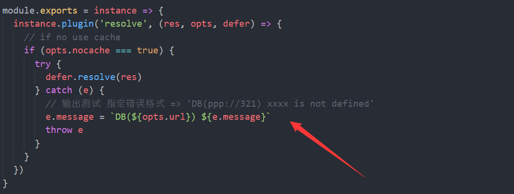

#omelete-db

### 下载开发库
npm install --save-dev karma
npm install --save-dev webpack
npm install --save-dev mocha

### 先做测试用例
1.编写 karma.conf.js
查 karma文档  https://karma-runner.github.io/1.0/config/configuration-file.html
使用 karma init 配置初始文件
> 1. **files:  添加外部 files**
> 需要引入的如 jQuery (未添加)
>   
> 2. **browsers:  ['Chrome', 'PhantomJS'] **
> 需要安装 `karma-chrome-launcher`, `karma-phantomjs-launcher`
> 
> 3. **reporters: ['mocha', 'should;'']**
> 为使karma日志输出保持mocha原来的风格 使用 `karma-mocha-reporter`
> 为使用 should.js 断言 安装 `should`, `karma-should`
> 
> 4. **preprocessors: { 'test/*spec.js': ['webpack'] } **
> 使用 webpack  使用 `karma-webpack`  需要提前安装 `babel-core`
> 5. **webpack:** 配置 测试webpack，
> 设置 rules 使用 es6 语法 ：
> ```javascript
	{
        test: /\.js$/,
        exclude: /(node_modules|bower_components)/,
        use: [
          {
            loader: 'babel-loader',
            options: {
              presets: ['es2015']
            }
          }
        ]
      }
> ```
> babel 6默认情况下并没有转换ES6代码的功能，需要安装相应的转换器插件 `babel-preset-es2015`

然后在spec.js编写使用should断言的es6代码，测试 karma start 运行是否正常
> 附上各个文档地址
> karma configuration file: https://karma-runner.github.io/1.0/config/configuration-file.html
> should.js https://shouldjs.github.io/
> mocha https://mochajs.org/
> karma-should https://github.com/ruimarinho/karma-should
> babel-preset-env https://github.com/babel/babel-preset-env

2.分析需求，并把最基础的测试用例写出来
> 需求： https://github.com/kangschampagne/homework3

> 1. 后台返回数据结构为
> ```javascript
> {
>   retcode: Number, // 可以是0(正确)，1(登陆台丢失)等等
>   msg: String, // 错误时候返回的信息
>   res: any // 附带的结果
> }
> ```
>  `解决`：使用 大搜车的 easy-mock 进行 api 返回
>  BaseURL: https://www.easy-mock.com/mock/59c74abbe0dc663341b6ef18/omelete-db
> 
> 2. 每一种请求都可以通过 localStorage 做缓存
> 缓存策略: 
>> // 0. 默认，情况下，如果没缓存，成功请求回调一次，如果有请求成功缓存应当回调两次，这样可以保证页面快速渲染，而不需要等数据返回
>> 
>// 1. lazy更新，有缓存的情况下直接读取缓存，只有一次回调，但会发出请求，请求返回后只更新缓存里的数据为最新的，这样，下次再调用就能拿到这次更新的数据了
> options.lazy = true
>>
>// 2. 在maxAge内使用缓存，则当发现缓存里的数据小于maxAge，则直接读取缓存，不发出任何请求，否则发出请求读取请求的数据
>options.maxAge = 1000 // 即缓存是1s，也就是说这个单位是ms
>  
> 可用的 oprtions 即：
> 1. refresh(ms)， 304 更新时间
> 2. lazy(boolean)，懒更新
> 3. level(1-3)，分3级缓存

>`解决`： 暂时想到的是，通过 Tapable 使用插件系统
> 就是什么情况的返回，会调用相应的 plugin 进行解决

 所以第一步的测试用例是， 
>1.可以使用 get 发起请求并携带 options 使其通过 endpoint 插件， 完成请求后返回 options 的 值。暂不使用缓存。
>
>
>
>
>
>
>这个时候需要 resolve  成功success的回调。
>做法是：添加缓存组件。 并注册一个 resolve 的 plugin 处理结果。
>
>
>
>执行 success callback 的所有函数

第二个测试用例
> 2.should able to throw error
> 可以使用get发起请求并携带 options 使其通过 endpoint 插件， 完成请求后， 设置抛错条件， 并在 catch 中 获取错误。
>
>
>
> 
>
> 捕获了错误，但是没有办法抛出具体的错误， 所以使用 一个 catch 组件捕获错误，并输出。
> 获取输出的错误格式为： `DB(ppp://321) xxxx is not defined`
>> 尝试在 .catch() {} 中resolve请求，没有办法拿到 success callback 的参数。
>

> 将 success callback 在 catch 组件中处理
>
> 在Catch组件中 resolve => success callback 
>
> 在Cache组件中 执行resolve 插件， 获取真实错误并格式化
>

第 3 个测试 和 第 4 个测试 只多加了一个 Jquery.Defferd对象，其他与上面一样。创建完，异步立即resolve()，暂时忽略 judge plugin，所以暂时没看明白这两个测试干嘛用的。
> 第 3 个 ` should able to use jQuery.Defer `
> 第 4 个 ` should able to throw error when using jQuery.Defer `

第 5 个 测试用例
> ` should able to use judge `
> 创建一个 judge 插件，并返回 false。发起get请求，并调用fail()（这个怎么解释）
> 所以就注册一个 judge 处理， 只要有一个能够处理，立即返回值， 测试用例中，这个只做判断，返回值为 Boolean
>
> 在 Defer 中，做这个 reject， 执行所有 failCallback
>
>
